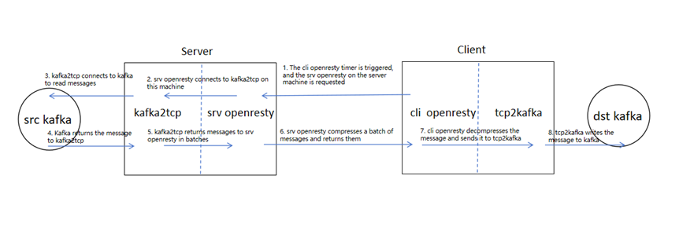

# Kafka Bridge Integration Architecture Diagram



The illustrated setup requires deployment on two separate systems. One functions as the client, positioned near the destination Kafka system (where information is to be written) and is configured with two components: cli openresty and tcp2kafka. The other system serves as the server, located closer to the source Kafka (from where messages are to be read), with srv openresty and kafka2tcp components installed.

The client system can utilize a Content Delivery Network (CDN), setting the server system as the origin, for accessing the server, alternatively, it can also access the server system directly.


# Components on the Client System

1. **cli openresty**

The entire workflow is initiated by a timer within cli openresty. This program utilizes two configuration files: an nginx configuration file and a lua configuration file.

The nginx configuration file is located at: /usr/local/openresty/nginx/conf/nginx.conf. See below for configuration details:

```

user  root;
#Set to the maximum number of partitions
worker_processes  40;
error_log  logs/kafka.log error;
pid        logs/nginx.pid;

events {
    worker_connections  10240;
}

http {
    include       mime.types;
    default_type  application/octet-stream;

    resolver 8.8.8.8 valid=600s ipv6=off;
    sendfile        on;
    keepalive_timeout  65;
    lua_shared_dict kafka_ctl 16k;
    init_worker_by_lua_file ../lualib/koala/kafka/init.lua;
    server {
        listen       127.0.0.1:8001;
        server_name  localhost;
        location /stop {
                content_by_lua_file ../lualib/koala/kafka/stop.lua;
        }
        location / {
                return 403;
        }

    }
}

```

The Lua configuration file is located at: /usr/local/openresty/lualib/koala/kafka/config.lua. See below for configuration details:

```
local _M = {}

--Polling pull time in seconds
_M.loop_time = 5

-- /kafka/EA3F80826F05C123B3CA9BD10B75A23D/get.txt Path for the default directory, modify need pairing with the server
--maxbuf=4000 indicates that a batch should be as large as 4000KB before being compressed and sent, and can also be replaced with maxline to indicate how many batches should be compressed and sent.
-- The form of the argument is not recommended to be changed
--partition indicates the number of partitions and is a constant
--
local kafka_uri_1 = "http://{kafka2http serer addr/domain}/kafka/EA3F80826F05C123B3CA9BD10B75A23D/get.txt?maxbuf=4000&partition="

-- loop_task: {R port, W port, P num, URL}
-- {8101, 8201, 20, kafka_uri_1},
-- 8101 Indicates which kafka2tcp program is consumed by the remote, and the consumed port corresponds to a different topic
-- 8201 The tcp2kafka program, which indicates which port was used locally, also corresponds to a different topic
-- 20   Number of partitions
-- kafka_uri_1 Indicates which connection to read, and the ser side

_M.loop_task = {
        {8101, 8201, 20, kafka_uri_1},
        {8121, 8221, 3, kafka_uri_1},
}

_M.token = "0123456789abcdef"

return _M

```


2. **tcp2kafka**

For this component, each topic has its own configuration file. The configuration file name should typically indicate which port it is monitoring. For instance, if the monitored port is 8221, then the topic name could be `topic_name`.

See below for configuration details:

```

#kafka configuration file, key Max 127, val Max 255, Max 20 configuration items
The bootstrap. The servers = 127.0.0.1:9092
topic.name=topic_name
acks=1

# Compression method
compression.type=zstd

# Server start port to use for communication with openresty
port=8221

# Max message per write

message.max.bytes=104858800

```

# Components on the Server System

1. **srv openresty**

The configuration file is located at: /usr/local/openresty/nginx/conf/nginx.conf. See below for configuration details:

```
user  root;
worker_processes  auto;

error_log  logs/error.log error;

pid        logs/nginx.pid;


events {
        worker_connections  10240;
}


http {
        include       mime.types;
        default_type  application/octet-stream;

        resolver 127.0.0.53 valid=300s ipv6=off;

        log_format fmt
                '$host|$request_method|$request_uri|$scheme|'
                '$status|$upstream_http_via|'
                '$remote_addr|$http_referer|$upstream_response_time|$request_length|$http_user_agent|'
                '$server_addr|$server_port|$bytes_sent|$upstream_addr|'
                '$http_range|$body_bytes_sent|$request_time|[$time_local]|$upstream_response_time|$http_asd';

        access_log  logs/access.log  fmt;

        sendfile        on;

        keepalive_timeout  65;

        lua_shared_dict cache_kafka 400m;
        lua_shared_dict kafka_lock 2m;
        lua_shared_dict kafka_ctl 16k;

        server {
                listen       80;
                server_name  localhost;

                location /kafka/EA3F80826F05C123B3CA9BD10B75A23D/get.txt {
                        error_log  logs/kafka_info.log;
                        content_by_lua_file ../lualib/koala/kafka/tcp2http.lua;
                }

                location /test.html {
                        root   html;
                        index  index.html index.htm;
                }

                location /
                {
                        return 403;
                }

        }
}


```

2. **kafka2tcp**

The configuration file is located at: /root/install/kafka2tcp_v1/kafka2tcp.conf. See below for configuration details:

```

#kafka configuration file, key Max 127, val Max 255, Max 20 configuration items
# Case sensitive, [main] is the main option, and [port number] is a separate option for each child process
# Bind one topic per port and one child process with the number of partitions corresponding to the number of threads in the child process
# Each thread consumes its own partition message, keeping it in order
[main]
access_log=access-k2t.log
error_log=error-k2t.log
log_level=debug
pid=kafka2tcp.pid

[8101]
#kafka servers addr
bootstrap.servers=11.3.1.59,10.8.0.65
#Consumer id
group.id=kafka-to-tt0
auto.offset.reset=earliest
#topic name
topic.name=gzz_test335
# Number of partition
partition.num=6

[8102]
bootstrap.servers=11.3.1.59,10.8.0.65
group.id=kafka-to-gg1
auto.offset.reset=earliest
topic.name=gzz_test_new_1
partition.num=4


```

# Component Download


Download: https://dl.dlink.cloud/client/kafka_bridge-v1.3.7.zip


