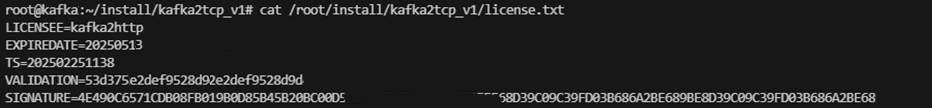

# Steps to Update the KafkaBridge License
### How to Check the Expiration Date of the KafkaBridge Component's License?

Access the machine where the component is deployed and review the file located at: /root/install/kafka2tcp_v1/license.txt. The 'EXPIREDATE' field contains the expiration date of the license, as shown in the picture below:

The expiration date shown in the image above is May 13, 2025.

### How to Obtain a New License?

1. Execute the program located at /root/install/kafka2tcp_v1/get_id on the machine to obtain the output result.
2. In the Dlink management platform, navigate to the KafkaBridge menu to initiate a new authorization.
3. Input the output result obtained from step 1.
4. Once you save it, a new license.txt file with the updated license will be produced.

### How to Update the License?

Transfer the new license.txt file to the directory /root/install/kafka2tcp_v1/, this will directly replace the existing license.txt file.

### Notes:

1. If the directory /root/install/kafka2tcp_v1/ exists on the machine, it signifies that the machine is a server. It's crucial to keep track of the license expiry date.
2. Manual alterations to the license file are not advisable. Any modifications could lead to a failed license validation check causing the program to halt operation.
3. The license files are not interchangeable among multiple machines. When updating the license, each machine must retrieve its own unique license.
4. Please make sure to replace the license.txt file with a new one at least a day in advance.
